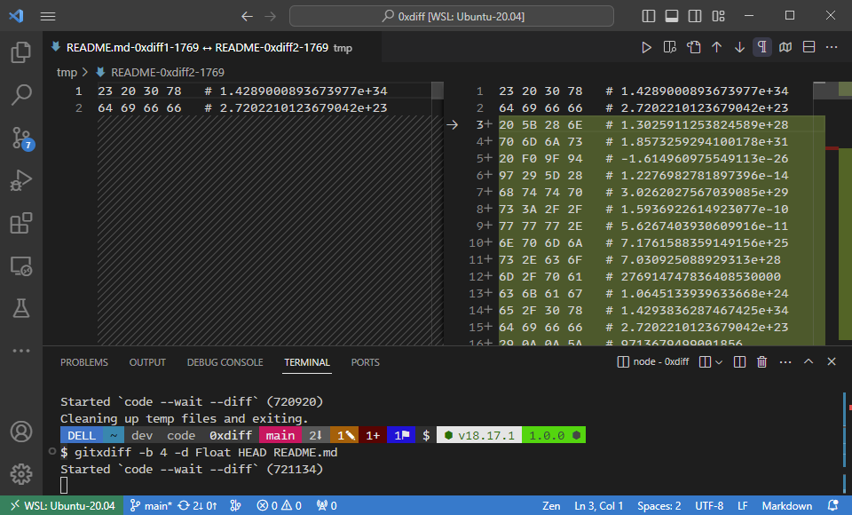

# 0xdiff [(npmjs 🔗)](https://www.npmjs.com/package/0xdiff)

Zero dependency CLI tool to diff binary files. 

## Requirements
- shell (WSL2 on Windows)
- node >= 18.17.1
- vscode

## Install
`npm i -g 0xdiff`

## Usage
```
0xdiff 1.0.0
Converts bin file to diffable text and starts `code --diff`

Usage: 0xdiff [options] <file> <file>

Options
  -b --bytes-per-row <bytes>                        [1, 2, 4, (8), 16, 32, 64].
  -s --max-size <size>                              MB max file size for compare(1).
  -k --keep                                         Do not discard temp files on exit.
  -d --debug <Double|Float|(Big)(U)Int(16|32|64)>   Displays value for each hex row.
  -e --endianness <l | little | b | big>            Only used with -d (little)
  -h --help                                         Display this help text.
```


## Git Diff
The cli tool does not feature git diffs natively at this point.  
You can utilize the `git cat-file` command to achieve this for now.
```bash
git cat-file -p <SHA>:<FILE> > <FILE>.tmp \
&& 0xdiff <FILE>.tmp <FILE> \
&& rm <FILE>.tmp
```

Append it as a shell function in your .bashrc:
```bash
gitxdiff() {
  sha="${@: -2:1}"
  file="${@: -1}"
  opts="${@:1:$#-2}" 
  git cat-file -p $sha:$file > $file.tmp \
  && 0xdiff $opts $file.tmp $file \
  && rm $file.tmp
}
```

### Demo
Git diff between checked in file and local changes:
#### `gitxdiff HEAD README.md`


## Options

### --bytes-per-row
Use this option to change how to diff your binary data.

#### `--bytes-per-row 4`


#### `--bytes-per-row 16`


### --max-size
**OBS❗**  
This application was developed with _small_ binary files in mind, which is why
the hacky solution of using the text diff tool works.  
Converting binary files to utf-8 text files like this effectively makes them **300%**
larger in size.
Doing `diff` on large files consumes a lot of processing and memory resources,
specially if there are  also many changes which is often the case with binary files.

The `--max-size` is an override to the 1MB precautionary max size.

You can increase the amount of time that vscode will compute the diff with the
following vscode setting:
```jsonc
{
  // Timeout in milliseconds after which diff computation is cancelled. Use 0 for no timeout.
  "diffEditor.maxComputationTime": 5000
}
```

### --debug
If you want to debug the value of each row.  
Note that the `bit` of the chosen debug format can not be greater than the bits
represented on each row, as set with the `--bytes-per-row` option, see table.

| format    |   -b |
| --------- | ---: |
| BigInt64  |    8 |
| BigUInt64 |    8 |
| Double    |    8 |
| Float     |    4 |
| Int16     |    2 |
| Int32     |    4 |
| UInt16    |    2 |
| UInt32    |    4 |

#### --debug Float


#### --debug Int16


### --endianness
This option is only used with the `--debug` option.  
If you are working with binary files you probably know what to do with this option.

### --keep
Stop `0xdiff` from removing the temporary files when exiting.  
Please note that this option will leave dangling files in your OS temp directory.
